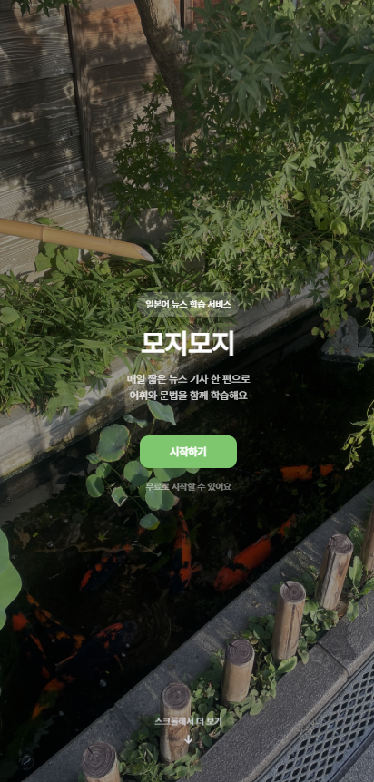
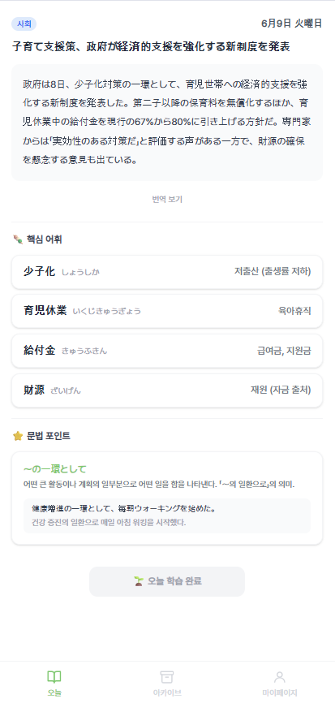
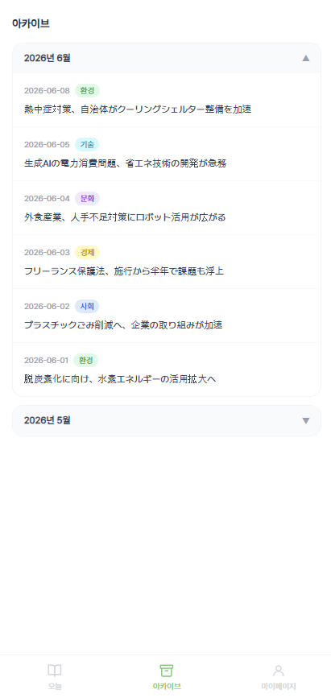
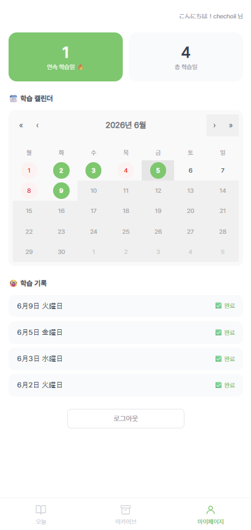

# 모지모지 (mojimoji)

> 매일 짧은 뉴스 기사 한 편으로 어휘와 문법을 함께 익히는 일본어(N2) 학습 서비스

🔗 **[모지모지](https://mojimoji-nu.vercel.app)**

<br />

## 📗 프로젝트 소개

모지모지는 일본어를 목표로 하는 학습자를 위한 웹 서비스입니다.  
평일마다 일본 뉴스 기사 한 편이 업데이트되며, 기사 속 핵심 어휘와 문법 포인트를 함께 학습할 수 있습니다.  
꾸준한 학습을 돕기 위해 스트릭과 캘린더 기반의 학습 기록 기능을 제공합니다.

<br />

## ✨ 주요 기능

| 기능              | 설명                                    |
| ----------------- | --------------------------------------- |
| 📰 매일 뉴스 학습 | 평일마다 새로운 일본어 뉴스 기사 제공   |
| 📖 어휘 학습      | 기사 속 N2 핵심 어휘 4개 (단어·읽기·뜻) |
| 📝 문법 학습      | 기사에 등장한 N2 문법 패턴과 예문       |
| 🔥 학습 스트릭    | 연속 학습일 및 총 학습일                |
| 🗓️ 학습 캘린더    | 완료일(초록), 놓친 날(빨강) 시각화      |
| 📚 아카이브       | 지난 기사 월별 그룹핑 및 재학습         |

<br />

## 👩‍💻 기술 스택

**Frontend**

- React + TypeScript
- Vite
- Tailwind CSS
- React Router
- Zustand (전역 인증 상태 관리)
- TanStack Query (서버 상태 관리)
- SweetAlert2 (알림창)
- react-calendar (학습 캘린더)

**Backend / Database**

- Supabase (PostgreSQL, Auth, RLS)

**Deploy**

- Vercel

<br />

## 📂 프로젝트 구조

```
src/
├── components/
│   ├── today/          # TodayPage 섹션 컴포넌트 (ArticleSection, VocabSection, GrammarSection)
│   ├── mypage/         # StudyCalendar
│   ├── LoadingSpinner.tsx
│   ├── BottomNav.tsx
│   ├── Layout.tsx
│   └── ProtectedRoute.tsx
├── pages/
│   ├── LandingPage.tsx
│   ├── LoginPage.tsx
│   ├── TodayPage.tsx
│   ├── ArchivePage.tsx
│   ├── ArticleDetailPage.tsx
│   └── MyPage.tsx
├── hooks/              # TanStack Query 커스텀 훅
│   ├── useTodayArticle.ts
│   ├── useStudyRecord.ts
│   ├── useStudyHistory.ts
│   ├── useArchive.ts
│   ├── useArticle.ts
│   └── useArticleDates.ts
├── store/
│   └── authStore.ts    # Zustand 인증 스토어
└── lib/
    ├── supabase.ts
    ├── date.ts
    ├── streak.ts
    ├── category.ts
    └── swal.ts
```

<br />

## 🗂️ 데이터베이스 구조

```
articles          - 기사 (id, title, body, translation, category, published_date)
vocabularies      - 어휘 (id, article_id, word, reading, meaning, order_index)
grammar_points    - 문법 (id, article_id, pattern, explanation, example_jp, example_kr)
study_records     - 학습 기록 (id, user_id, article_id, studied_at, is_completed)
```

<br />

## 📷 스크린샷

<!-- 스크린샷 추가 예정 -->

| LandingPage                                            | TodayPage                                            | ArchivePage                                            | MyPage                                            |
| ------------------------------------------------------ | ---------------------------------------------------- | ------------------------------------------------------ | ------------------------------------------------- |
|  |  |  |  |

<br />

## 🚀 로컬 실행

```bash
# 패키지 설치
npm install

# 환경변수 설정 (.env)
VITE_SUPABASE_URL=your_supabase_url
VITE_SUPABASE_ANON_KEY=your_supabase_anon_key

# 개발 서버 실행
npm run dev
```
